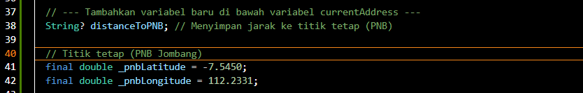
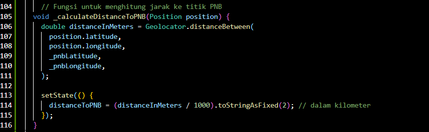
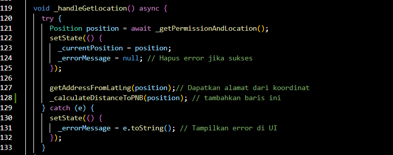
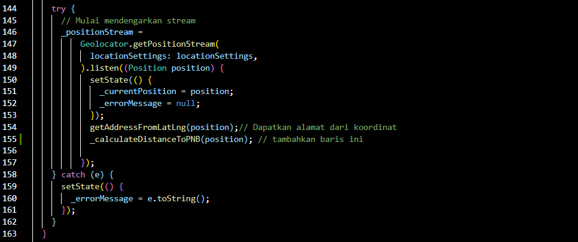
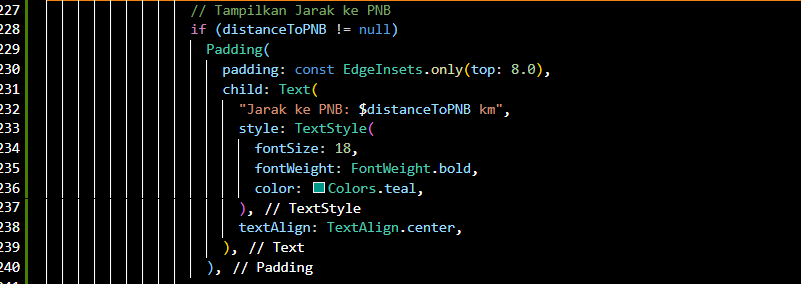
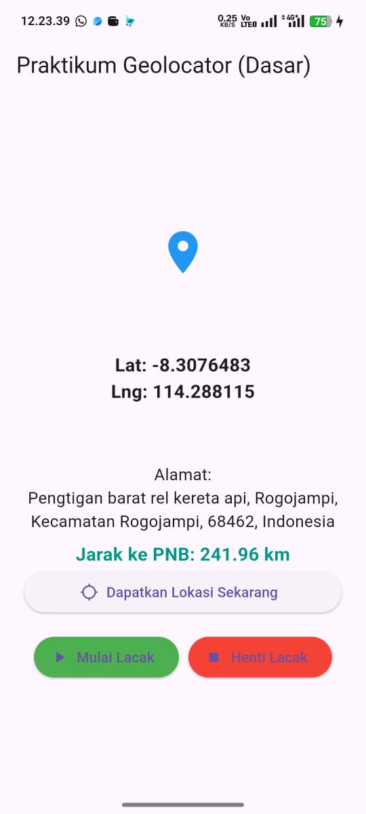

# prak_gps

**Tugas 2**: Jarak Real-time ke Titik Tetap

Manfaatkan fungsi Geolocator.distanceBetween dari Langkah 4.
1. Buat variabel String? distanceToPNB; di MyHomePageState.

Variabel ini digunakan untuk menampilkan hasil perhitungan jarak di UI dan diperbarui setiap kali lokasi berubah.

2. Di dalam startTracking (di dalam .listen()), panggil fungsi untuk menghitung
jarak:

Sehingga saat tombol "Dapatkan Lokasi Sekarang" ditekan, jarak langsung muncul.

3. Simpan hasilnya di distanceToPNB menggunakan setState.

A. panggil fungsi jarak saat ambil lokasi pertama kali

Fungsi pemanggilan ini memastikan jarak muncul meskipun tracking belum diaktifkan.

B. panggil fungsi jarak di stream pelacakan real-time

Setiap perubahan lokasi akan memperbarui jarak secara otomatis.

4. Tampilkan distanceToPNB di UI agar jaraknya ter-update secara real-time saat
Anda bergerak

Jarak akan tampil di bawah informasi lokasi pengguna dan diperbarui secara real-time.

5. Output
